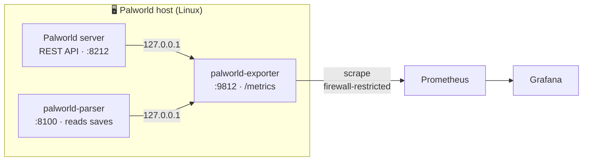

<div align="center">

# 🎮 palworld-exporter

**Prometheus exporter for a dedicated [Palworld](https://www.pocketpair.jp/palworld) server — live server health _and_ deep save‑file stats, right on the game host.**

[](https://github.com/frakev/palworld-exporter/releases/latest)
[](https://github.com/frakev/palworld-exporter/actions/workflows/ci.yml)
[](go.mod)
[](LICENSE)


[Install](#-install) · [Metrics](#-metrics) · [Securing /metrics](#-exposing--securing-metrics) · [PromQL](#-example-queries-promql)

</div>

---

Graph and alert on your Palworld server in Grafana. The exporter runs **on the game host**, exposes **only Palworld‑related information** (no host CPU/RAM/disk), and has **no external dependency** — it talks to the game's own local APIs.

## ✨ Features

- **📊 Live server metrics** — FPS, frame time, connected players (ping & position), max players, version — straight from Palworld's official REST API.
- **🐾 Per‑player save stats** — Pals per player split into **box / party / lucky**, plus level, captures, technologies, bosses, dungeons… parsed from the save files.
- **🔌 Standalone** — no game mod, no sidecar agent. Just the server's REST API + an optional local save parser.
- **📦 Prebuilt Linux binaries** — download from [Releases](https://github.com/frakev/palworld-exporter/releases) (amd64 & arm64), or build from source.
- **🔒 Hardened & read‑only** — unprivileged systemd unit, loopback‑only backends, secrets never leave the host.

## 🔧 How it works



On every scrape the exporter:

1. reads the parser's `/metrics-data` (a cached snapshot — cheap) for save‑derived per‑player stats;
2. calls the game's REST API (`/v1/api/metrics`, `/v1/api/info`, `/v1/api/players`) for live server state;
3. renders everything as Prometheus text.

Each source is independent and best‑effort: if the parser is down you still get live metrics (`palworld_stats_up 0`); if the server is stopped you still get save stats and `palworld_game_online 0`.

> **Compatibility** — developed against **Palworld dedicated server `v1.0.3.101283`** (Steam app `2394010`). Live metrics come from the REST API and are essentially version‑independent; the save parser reads the `PlM1` (Oodle‑compressed) format via [`palworld-save-tools`](https://github.com/cheahjs/palworld-save-tools) `0.24.0`, so it's the part tied to a game version.

## ✅ Requirements

- **Palworld's REST API enabled** in `PalWorldSettings.ini`:

  ```ini
  RESTAPIEnabled=True
  RESTAPIPort=8212
  AdminPassword="your-admin-password"
  ```

  The exporter authenticates as `admin` with `AdminPassword` over loopback. No mod or agent required.

- **Python ≥ 3.11** on the host — _only_ if you want the save‑stats parser (it needs the `pyooz` Oodle wheel). On RHEL/Rocky 9: `sudo dnf install -y python3.12`. Without it, live metrics still work.
- **Prometheus** to scrape it (plain Prometheus, kube‑prometheus‑stack, …).

## 🚀 Install

### Prebuilt binary (recommended)

Static Linux binaries (amd64 & arm64) ship on every [**release**](https://github.com/frakev/palworld-exporter/releases) — no Go toolchain needed. Each tarball bundles the binary, `install.sh`, the systemd unit, `config.example.env`, and the `parser/` sources.

```bash
# grab the archive for your arch from the latest release (see Releases for the exact name)
curl -sSL -o palworld-exporter.tar.gz \
  https://github.com/frakev/palworld-exporter/releases/latest/download/palworld-exporter_v0.1.0_linux_amd64.tar.gz
tar -xzf palworld-exporter.tar.gz && cd palworld-exporter_*_linux_amd64

# <IP> = the source IP the game host sees when Prometheus scrapes it (see "Securing /metrics")
sudo ./install.sh --home-ip <IP>
```

`install.sh` auto‑detects `AdminPassword`/`RESTAPIPort` from the `.ini`, creates an unprivileged system user, opens port `9812` **only to `<IP>`** (firewalld/ufw), and installs a locked‑down unit. Checksums are published as `checksums.txt`.

For the save‑stats parser (optional):

```bash
sudo ./parser/install.sh --save-dir /path/to/Pal/Saved/SaveGames
```

### From a checkout (remote deploy)

Run from a machine that can SSH to the game host:

```bash
make deploy REMOTE=user@game-host HOME_IP=<IP>                              # exporter
make parser-deploy REMOTE=user@game-host SAVE_DIR=/path/to/SaveGames        # parser
```

### Build from source

```bash
make build      # -> ./palworld-exporter (static, CGO-free)
make test
```

### Verify

```bash
curl -s http://127.0.0.1:9812/metrics | head
curl -s http://127.0.0.1:8100/metrics-data | head   # parser snapshot (JSON)
```

## ⚙️ Configuration

**Exporter** — `/etc/palworld-exporter/exporter.env` (see [`config.example.env`](config.example.env)):

| Key | Default | Purpose |
|---|---|---|
| `LISTEN` | `:9812` | HTTP listen address for `/metrics` |
| `REST_URL` | `http://127.0.0.1:8212` | Palworld REST API base URL |
| `REST_USER` | `admin` | Basic‑auth user |
| `REST_PASSWORD` | — | the server's `AdminPassword`; empty = live metrics disabled |
| `PARSER_URL` | `http://127.0.0.1:8100` | save‑stats parser; empty = no save metrics |
| `METRICS_TOKEN` | _(empty)_ | if set, `/metrics` requires `Authorization: Bearer <token>` |

**Parser** — `/etc/palworld-parser/parser.env` (see [`parser/config.example.env`](parser/config.example.env)). The one setting to get right is **`SAVE_DIR`**, your `SaveGames` folder:

```bash
SAVE_DIR=/home/steam/Steam/steamapps/common/PalServer/Pal/Saved/SaveGames
REPARSE_INTERVAL=300     # re-parse the saves every 5 min (0 = disabled)
```

## 📡 Prometheus scrape config

```yaml
scrape_configs:
  - job_name: palworld
    scrape_interval: 30s
    static_configs:
      - targets: ["<game-host>:9812"]
    # If METRICS_TOKEN is set on the exporter (see below):
    # authorization:
    #   type: Bearer
    #   credentials: "<METRICS_TOKEN>"
```

## 🔐 Exposing & securing `/metrics`

`/metrics` is **plain HTTP, unauthenticated by default**, and includes information about your server (player names, positions, FPS…). Don't leave port `9812` open to the whole internet — pick **one**:

<table>
<tr><th>Option A — firewall to one source IP <em>(installer default)</em></th></tr>
<tr><td>

`install.sh --home-ip <IP>` restricts the port to one source address: the machine that scrapes it. `<IP>` is **the source IP the game host sees when Prometheus connects**:

| Where Prometheus runs | `<IP>` to use |
|---|---|
| **Same machine** as the server | `127.0.0.1` (nothing opened to the network) |
| **Same LAN** as the game host | Prometheus's LAN IP |
| Elsewhere, behind a router (remote game host) | the **public IP** of that network (`curl ifconfig.me` from there) — NAT makes all its traffic arrive from that one address |

Simple and dependency‑free, but awkward if that IP is **dynamic** — then prefer option B.

</td></tr>
</table>

<table>
<tr><th>Option B — bearer token <em>(good for dynamic IPs)</em></th></tr>
<tr><td>

Set a token in `/etc/palworld-exporter/exporter.env` and restart the service:

```bash
METRICS_TOKEN=$(head -c 32 /dev/urandom | base64 | tr -dc A-Za-z0-9)
```

Now `/metrics` rejects requests without `Authorization: Bearer <token>`, so the port can be reachable from more than one address. Give Prometheus the same token:

```yaml
    authorization:
      type: Bearer
      credentials: "<METRICS_TOKEN>"
```

</td></tr>
</table>

You can combine A with B for defence in depth.

## 📈 Metrics

All gauges, prefixed `palworld_`. Highlights:

- **Server** — `palworld_game_online`, `palworld_server_fps`, `palworld_players_current`
- **Per player (live)** — `palworld_player_online`, `palworld_player_ping_ms`
- **Per player (saves)** — `palworld_player_pals_box`, `palworld_player_pals_party`, `palworld_player_pals_lucky`, `palworld_player_level`, `palworld_player_captures`

<details>
<summary><b>Full metrics reference</b></summary>

### Live server & game (via the REST API)

| Metric | Description |
|---|---|
| `palworld_game_online` | 1 if the game REST API answers (server up and ready) |
| `palworld_game_info{version,server_name}` | server version & name (value = 1) |
| `palworld_server_fps` | server FPS |
| `palworld_server_frametime_ms` | server frame time (ms) |
| `palworld_players_current` / `palworld_players_max` | connected / max players |
| `palworld_game_uptime_seconds` | uptime reported by the game |
| `palworld_player_online{name,player_id}` | 1 per connected player |
| `palworld_player_ping_ms{name,player_id}` | connected player ping |
| `palworld_player_location_x{…}` / `_y{…}` | connected player map position |
| `palworld_scrape_duration_seconds` | collection time |

### Save stats (via the parser — labels `uid,name,guild`)

| Metric | Description |
|---|---|
| `palworld_stats_up` | 1 if the parser responds |
| `palworld_stats_snapshot_timestamp_seconds` | last save parse (epoch) |
| `palworld_guilds_total` / `palworld_players_known_total` | guilds / known players |
| `palworld_pals_total` / `palworld_pals_lucky_total` | owned / lucky Pals (server‑wide) |
| `palworld_player_level` / `palworld_player_exp` | level / XP |
| `palworld_player_pals_owned` | total Pals owned |
| **`palworld_player_pals_box`** | **Pals in the palbox** |
| **`palworld_player_pals_party`** | **Pals in the active party** |
| `palworld_player_pals_lucky` | lucky (shiny) Pals |
| `palworld_player_captures` / `palworld_player_tribes_captured` | captures / species |
| `palworld_player_paldeck` | Paldeck entries |
| `palworld_player_technologies` / `palworld_player_technology_points` | techs / points |
| `palworld_player_boss_technology_points` | ancient (boss) tech points |
| `palworld_player_tower_bosses` / `palworld_player_field_bosses` | tower / field bosses |
| `palworld_player_dungeons` | dungeons cleared |
| `palworld_player_zones_explored` / `palworld_player_fast_travels` | exploration |
| `palworld_player_effigies` / `palworld_player_quests_completed` | effigies / quests |
| `palworld_player_last_online_timestamp_seconds` | last login (epoch) |

</details>

`palworld_game_*` and per‑connected‑player metrics only appear while the server is running; save stats stay available even when it is stopped.

<details>
<summary><b>Sample output</b></summary>

```prometheus
palworld_game_online 1
palworld_game_info{version="v1.0.3.101283",server_name="My \"Example\" Server"} 1
palworld_server_fps 58.4
palworld_players_current 2
palworld_player_ping_ms{name="Alice",player_id="abc123"} 42.5

palworld_stats_up 1
palworld_pals_total 137
palworld_pals_lucky_total 3
palworld_player_level{uid="a1b2c3d4",name="Alice",guild="ExampleWorld"} 42
palworld_player_pals_box{uid="a1b2c3d4",name="Alice",guild="ExampleWorld"} 25
palworld_player_pals_party{uid="a1b2c3d4",name="Alice",guild="ExampleWorld"} 5
palworld_player_pals_lucky{uid="a1b2c3d4",name="Alice",guild="ExampleWorld"} 2
palworld_player_captures{uid="a1b2c3d4",name="Alice",guild="ExampleWorld"} 410
```

</details>

## 🔎 Example queries (PromQL)

```promql
# Connected players over time
palworld_players_current

# Server FPS
palworld_server_fps

# Pals in each player's box, top 10
topk(10, palworld_player_pals_box)

# Total lucky Pals on the server
palworld_pals_lucky_total

# Alert: server went offline
palworld_game_online == 0

# Alert: saves haven't been parsed in over an hour
time() - palworld_stats_snapshot_timestamp_seconds > 3600
```

## 🛡️ Security

- **Read‑only, unprivileged** — the systemd unit runs with `NoNewPrivileges`, `ProtectSystem=strict`, a syscall filter, etc.
- **Loopback‑only backends** — the game REST API and the parser are reached over `127.0.0.1`. Your `AdminPassword` lives in `exporter.env` (mode `0640`, owned by the exporter user) and never leaves the host.
- **Lock down `/metrics`** — plain HTTP and unauthenticated by default; use a firewall rule or a bearer token → [Exposing & securing `/metrics`](#-exposing--securing-metrics).
- **Never commit** a real `*.env`, password, or save file — see [`.gitignore`](.gitignore).

## 🧩 How the save parser works

The parser reads `Level.sav` + `Players/*.sav` from your `SaveGames` world folder, decompresses the `PlM1`/Oodle blocks (`pyooz`), decodes the GVAS structures (`palworld-save-tools`), and aggregates per‑player counters and Pal container membership (box vs party vs base). It caches a snapshot in SQLite and re‑parses on an interval, so scrapes stay cheap. It listens on `127.0.0.1` only and serves `GET /metrics-data` (JSON). Because it depends on the save format, it's the component tied to a specific game version (`v1.0.3.101283`).

## 📄 License

[MIT](LICENSE) © frakev
